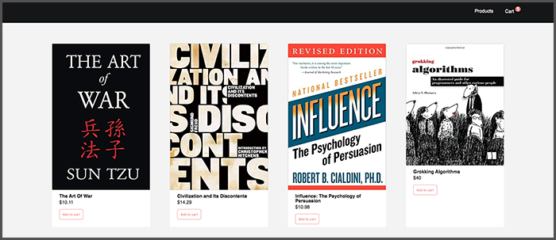
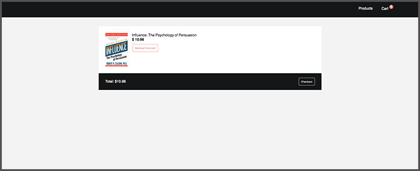

# Context API - Shopping Cart

Context api is how you are able to store data on a context object and retrieve that data in the necessary components.  This simple online bookstore with a shopping cart is a demonstration of how to use `Context API`.

 

# <a href="http://jasheletillman.me/react-shopping-cart" target=_blank>Check it out Here</a>

 
 
 

## Contact Me:

 

**My Portfolio:** <a href="http://jasheletillman.me/" target=_blank>JasheleTillman.Me</a>
 
**My Blog:** <a href="https://jashele.blog/" target=_blank>Jashele.Blog</a>

 
 
 
